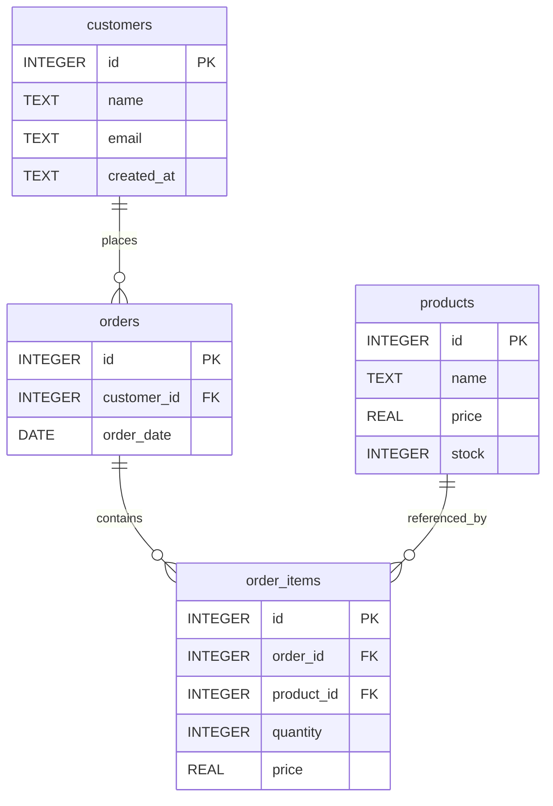

# SQL (SQLite Focused)

> A language for managing and querying databases. This tutorial focuses on SQL features supported by SQLite.

| Field          | Value                              |
| -------------- | ---------------------------------- |
| Difficulty     | Beginner / Intermediate            |
| Estimated Time | ~ 30 minutes                       |
| Prerequisites  | Basic understanding of tables and data types                    |
| Tags           | SELECT, FROM, WHERE, JOIN, GROUP BY |
| File (auto)    | docs/sql-sqlite.md                  |

---

## Goal

Learn how to select data from a SQLite database using the basic syntax of SQL.

---

## Concept

1. Definition: A language for querying and managing relational databases, focusing on SQLite.
2. Intuitive analogy: Consider it as a filter that can fetch specific records or data from tables stored in an SQLite database.
3. Why it matters: To retrieve, analyze, and manipulate data efficiently with minimal effort.
4. When to use vs when not to: Use for querying SQLite databases, avoid for tasks better suited to procedural programming languages.
5. Relation to previously learned chapters: This tutorial assumes familiarity with the structure of tables in SQLite databases.

### When to Use

- Querying an existing database to extract specific records.
- Performing calculations or aggregations on the data.
- Joining multiple tables together for analysis.

### When NOT to Use

- For tasks that require procedural logic like looping or conditionals (use a programming language instead).
- Creating, altering, or dropping tables and users (SQLite does not support these features natively).

---

## Default Practice Database (demo.db)

Schema tables:

- customers(id, name, email, created_at)
- products(id, name, price, stock)
- orders(id, customer_id, order_date)
- order_items(id, order_id, product_id, quantity, price)

Relationships:

- A customer has many orders.
- An order has many items.
- Each item references one product.

### ER Diagram



---

## Quick Syntax Reference

| Intent                  | Pattern (SQLite)         |
| ----------------------- | ------------------------ |
| Minimal usage           | `SELECT ... FROM table;` |
| SELECT specific columns | `SELECT column1, column2 ... FROM table;` |
| WHERE clause            | `WHERE condition;`       |
| ORDER BY                | `ORDER BY column ASC/DESC;` |
| GROUP BY                | `GROUP BY column;`       |
| JOIN multiple tables     | `JOIN table2 ON table1.id = table2.id;` |

---

## Step‑by‑Step Learning Path

1. Fetch all records from a single table:
   - Explanation: Shows how to query basic data without filtering or sorting.
   ```sql
   SELECT * FROM customers;
   ```
2. Filter the results based on a condition:
   - Explanation: Demonstrates using a WHERE clause to filter out records that meet a specific criteria.
   ```sql
   SELECT * FROM customers WHERE name = 'John Doe';
   ```
3. Sort the results based on a column:
   - Explanation: Illustrates using ORDER BY to arrange the returned rows in ascending or descending order.
   ```sql
   SELECT * FROM customers ORDER BY name ASC;
   ```
4. Select specific columns and sort them:
   - Explanation: Combines steps 1, 2, and 3 to return only requested columns and arrange them as desired.
   ```sql
   SELECT id, name FROM customers ORDER BY name ASC;
   ```
5. Join multiple tables based on a common column:
   - Explanation: Explains how to link two or more tables together to access their related data.
   ```sql
   SELECT c.name, o.order_date
   FROM customers c
   JOIN orders o ON c.id = o.customer_id;
   ```

---

## Examples (Canonical to Advanced)

### 1. Basic Form

```sql
SELECT * FROM customers;
```

### 2. Practical Query

```sql
SELECT id, name, email FROM customers WHERE name = 'John Doe';
```

### 3. With JOIN (if relevant)

```sql
SELECT c.name, o.order_date
FROM customers c
JOIN orders o ON c.id = o.customer_id;
```

---

## Performance & Practical Notes

| Topic               | Note                                                         |
| ------------------- | ------------------------------------------------------------ |
| Index usage         | Use indexes on frequently filtered columns (e.g., FKs, predicates). |
| Query planner hints | SQLite has limited explicit hints—focus on schema + indexes.   |
| Avoid               | Unnecessary subqueries / SELECT \*.                          |
| NULL behavior       | NULL values can affect calculations and comparisons.         |
| Type affinity       | SQLite automatically casts data types as needed during operations. |

---

## Common Mistakes

| Mistake | Why   | Fix             |
| ------- | ----- | --------------- |
| Failing to include the SELECT statement | Forgets to specify requested columns | Include a `SELECT` clause with desired columns |
| Neglecting the FROM clause | Leaves out the table name to query | Specify the table name using a `FROM` clause |
| Misusing JOIN syntax | Combines tables incorrectly or inappropriately | Ensure that the `ON` condition is correct and appropriate for the task |

Add 3–5 realistic items.

---

## Exercises

1. Story: "List each customer with total number of orders."
   - Expected: customer_id, order_count
2. Story: "Find customers who have placed orders containing a specific product."
   - Expected: id, name
3. Story: "Calculate the average price of all products."
   - Expected: avg_price
4. Story: "List orders that were placed after a given date."
   - Expected: order_id, customer_id, order_date
5. Story: "Find customers who have not placed any orders yet."
   - Expected: id, name

---

## Solutions

(Provide all 5 solutions.)

---

## Edge Cases

- Empty table / no matches
- NULL foreign key (if any)
- Duplicate logical rows (need DISTINCT?)
- Numeric computation with NULL

Explain expected behavior.

---

## Checklist

- [ ] I can define the concept in one sentence.
- [ ] I know minimal syntax from memory.
- [ ] I tested a query with and without a WHERE (or key modifier).
- [ ] I handled NULLs deliberately.
- [ ] I avoided unsupported features.
- [ ] I can explain one performance consideration.

---

## Summary

| Aspect          | Key Point |
| --------------- | --------- |
| Definition      | Retrieve specific data from an SQLite database using a structured language. |
| Core use        | To analyze and manipulate data efficiently in SQLite databases. |
| Core syntax     | `SELECT ... FROM table;` |
| Pitfall         | Neglecting the SELECT statement or FROM clause can lead to errors. |
| Performance tip | Use indexes on frequently filtered columns for optimal performance. |

---

## SQLite vs Generic SQL (This Topic)

| Aspect               | SQLite           | Other Engines       |
| -------------------- | ---------------- | ------------------- |
| Creating tables      | Not supported    | Supported           |
| Altering tables      | Not supported    | Supported           |
| Dropping tables      | Not supported    | Supported           |
| Procedural logic     | Limited support | Well-supported      |
| Query planner hints | Limited         | Wide variety        |

---

## Best Practices

- Include the SELECT statement with desired columns in every query.
- Use the FROM clause to specify the table name you want to query.
- Be aware of NULL values and how they can affect calculations and comparisons.
- Use indexes on frequently filtered columns for optimal performance.
- Avoid unnecessary subqueries or select \*.