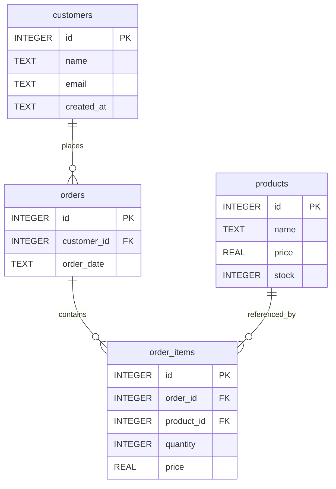

# {{TITLE}}

> One‑sentence plain English definition of the topic (SQLite focused).

| Field          | Value (fill)                       |
| -------------- | ---------------------------------- |
| Difficulty     | Beginner / Intermediate / Advanced |
| Estimated Time | ~ X minutes                        |
| Prerequisites  | List prior topics                  |
| Tags           | e.g. filtering, joins              |
| File (auto)    | docs/{{FILENAME}}.md               |

> IMPORTANT (SQLite Scope): Use ONLY SQLite features. Avoid: RIGHT/FULL OUTER JOIN, CREATE DATABASE, CREATE USER, GRANT/REVOKE, roles, stored procedures, function overloading, OUTER APPLY. If a feature is unavailable, explicitly state the limitation and give a safe alternative.

---

## Goal

State what the learner will be able to do after finishing (1–2 sentences, action oriented).

---

## Concept

1. Canonical definition (concise).
2. Intuitive analogy.
3. Why it matters (practical benefit).
4. When to use vs when not to.
5. Relation to previously learned chapters.

### When to Use

- Bullet list of valid scenarios.

### When NOT to Use

- Bullet list + suggested alternatives (still SQLite‑safe).

---

## Default Practice Database (demo.db)

Schema tables:

- customers(id, name, email, created_at)
- products(id, name, price, stock)
- orders(id, customer_id → customers.id, order_date)
- order_items(id, order_id → orders.id, product_id → products.id, quantity, price)

Relationships:

- A customer has many orders.
- An order has many items.
- Each item references one product.

### ER Diagram



---

## Quick Syntax Reference

| Intent                  | Pattern (SQLite)         |
| ----------------------- | ------------------------ |
| Minimal usage           | `SELECT ... FROM table;` |
| (Add topic specific #1) | `...`                    |
| (Add topic specific #2) | `...`                    |

Keep terse; details go in examples.

---

## Step‑by‑Step Learning Path

Provide 5 progressive steps:

1. Simplest viable example.
2. Add a realistic column / clause.
3. Introduce filtering / conditions.
4. Combine with JOIN / aggregation / expression (if relevant).
5. Edge case / refinement (NULL handling, aliasing, readability).

For each step: short explanation, code, expected shape of result (describe—do NOT dump large tables).

```sql
-- Step 1: (title)
-- Explanation
SELECT 1;
```

---

## Examples (Canonical to Advanced)

### 1. Basic Form

Short intent sentence.

```sql
SELECT ...;
```

### 2. Practical Query

```sql
SELECT ...;
```

### 3. With JOIN (if relevant)

```sql
SELECT ...
FROM orders o
JOIN customers c ON c.id = o.customer_id;
```

### 4. Aggregation / Calculation (if relevant)

```sql
SELECT c.name, COUNT(*) AS order_count
FROM customers c
JOIN orders o ON o.customer_id = c.id
GROUP BY c.id;
```

### 5. Advanced Variant / Edge Handling

Explain trade‑off (performance / clarity).

```sql
SELECT ...;
```

---

## Performance & Practical Notes

| Topic               | Note                                                         |
| ------------------- | ------------------------------------------------------------ |
| Index usage         | Mention which columns benefit (FKs, predicates).             |
| Query planner hints | SQLite has limited explicit hints—focus on schema + indexes. |
| Avoid               | Unnecessary subqueries / SELECT \*.                          |
| NULL behavior       | Describe how NULL affects this concept.                      |
| Type affinity       | Mention any relevant coercion concerns.                      |

---

## Common Mistakes

| Mistake | Why   | Fix             |
| ------- | ----- | --------------- |
| Example | Cause | Correct pattern |

Add 3–5 realistic items.

---

## Exercises

Guidelines:

- Use only demo.db tables.
- Return only requested columns.
- Avoid unsupported features.
- Escalate difficulty (Exercise 1 = medium baseline).

For each exercise provide:

1. Story style requirement.
2. Expected columns (list).
3. (Optional) Hint.
4. (Solution appears later—DO NOT inline here.)

Example format:

1. Story: "List each customer with total number of orders."
   - Expected: customer_id, order_count

Create 5 total.

---

## Solutions

Match numbering:

```sql
-- Exercise 1
SELECT c.id AS customer_id, COUNT(o.id) AS order_count
FROM customers c
LEFT JOIN orders o ON o.customer_id = c.id
GROUP BY c.id;
```

(Provide all 5 solutions.)

---

## Edge Cases

List 2–4:

- Empty table / no matches
- NULL foreign key (if any)
- Duplicate logical rows (need DISTINCT?)
- Numeric computation with NULL

Explain expected behavior.

---

## Checklist

- [ ] I can define the concept in one sentence.
- [ ] I know minimal syntax from memory.
- [ ] I tested a query with and without a WHERE (or key modifier).
- [ ] I handled NULLs deliberately.
- [ ] I avoided unsupported features.
- [ ] I can explain one performance consideration.

---

## Summary

| Aspect          | Key Point |
| --------------- | --------- |
| Definition      | ...       |
| Core use        | ...       |
| Core syntax     | `...`     |
| Pitfall         | ...       |
| Performance tip | ...       |

---

## SQLite vs Generic SQL (This Topic)

| Aspect               | SQLite           | Other Engines       |
| -------------------- | ---------------- | ------------------- |
| Typing               | Dynamic affinity | Stricter types      |
| Feature gap          | (List)           | (Availability)      |
| Workaround           | (Describe)       | (Native equivalent) |
| Function differences | (If any)         | (Counterpart)       |

---

## Further Reading

- Official SQLite docs (link)
- Related internal chapters
- High-quality external article (no blogs of dubious quality)

---

## Appendix (Optional)

(Only include if it adds clarity: extended pattern, full scenario, etc.)

---
